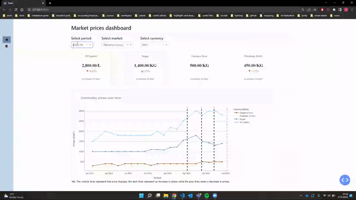

# Market prices dashboard



The **Food** Prices data for Rwanda was sourced from the [World Food Programme Price Database]((https://data.humdata.org/group/rwa)). We also took into account fuel price changes in Rwanda, which are announced through [RURA (Rwanda Utilities Regulatory Authority)](https://twitter.com/rura_rwanda).

## Getting Started

We suggest you create a separate virtual environment running Python 3 for this app, and install all of the required dependencies there. Then, download the `un_big_data_hackathon` file and type (in terminal):

```bash
python -m venv /path/to/new/virtual/environment
cd un_big_data_hackathon
``` 

In UNIX system:

```
source venv/bin/activate
```


In Windows:

```
venv\Scripts\activate
```

To install all of the required packages in this environment, simply run:

```
pip install -r requirements.txt
```

and all of the required packages will be installed.

To run the app:

```bash
python dashboard/app.py
```

